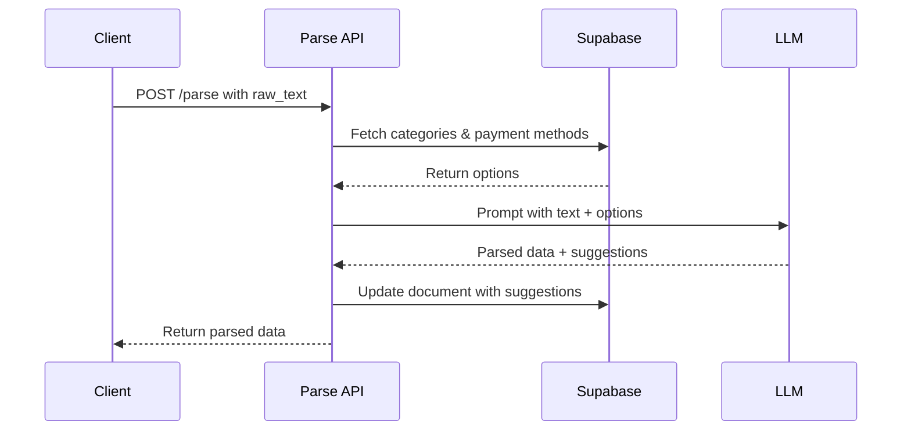

# Intelligent Category & Payment Method Suggestion Feature

## Summary

Added AI-powered category and payment method suggestion to the `/parse` endpoint. Now when documents are parsed, the LLM will intelligently suggest the most appropriate category and payment method based on the merchant name and transaction context.

## What Changed

### 1. **New Function: `fetch_categories_and_payment_methods()` in `parsing_service.py`**
   - Fetches all active expense categories, income categories, and payment methods from Supabase
   - Provides fallback to empty lists if fetch fails
   - Used to populate LLM prompt with available options

### 2. **Enhanced `build_parsing_prompt()` in `parsing_service.py`**
   - Now accepts categories and payment methods as parameters
   - Includes formatted list of all available options in the LLM prompt
   - Added specific matching rules for common scenarios:
     - Restaurants/cafes → "Eating Out"
     - Supermarkets → "Groceries"
     - Petrol stations → "Petrol"
     - Medical/pharmacy → "Health"
   - Instructs LLM to always provide a `suggested_category_id` (never null)
   - Requests `suggested_payment_method_id` when payment type is clear
   - Sets default currency to MYR

### 3. **Updated `parse_receipt_with_llm()` in `parsing_service.py`**
   - Fetches categories and payment methods before building prompt
   - Passes them to the enhanced prompt builder

### 4. **Enhanced `/parse` Endpoint in `parse.py`**
   - Extracts `suggested_category_id` and `suggested_payment_method_id` from LLM response
   - Saves these suggestions to the `documents` table
   - Logs suggested IDs for debugging

### 5. **Write Endpoint Already Compatible**
   - The `/write` endpoint already uses `suggested_category_id` and `suggested_payment_method_id` from the normalized_json
   - No changes needed here!

## How It Works



## Example

**Input:** "REES VILLAGE RESTAURANT" receipt

**LLM Analysis:**
- Merchant contains "RESTAURANT"
- Matches rule: restaurants → "Eating Out" category
- Suggests: `category_id: 2` (Eating Out)

**Output:**
```json
{
  "suggested_category_id": {"value": 2, "confidence": 0.85},
  "suggested_payment_method_id": {"value": 1, "confidence": 0.70},
  ...
}
```

## Testing

1. **Start the server:**
   ```bash
   python run.py
   ```

2. **Process a restaurant receipt:**
   - `/ingest` → upload document
   - `/extract` → get raw text
   - `/parse` → **NEW: Will suggest category_id: 2 (Eating Out)**
   - `/validate` → validate
   - `/write` → create transaction with correct category

3. **Check logs for:**
   ```
   Fetching categories and payment methods for document 258
   Suggested category ID: 2
   Suggested payment method ID: 1
   ```

4. **Verify in database:**
   ```sql
   SELECT 
     id, 
     vendor_name, 
     suggested_category_id,
     suggested_payment_method_id
   FROM documents 
   WHERE id = 258;
   ```

## Benefits

✅ **Accurate categorization** - "REES VILLAGE RESTAURANT" → "Eating Out" (not "Groceries")  
✅ **Reduces manual work** - Users don't need to manually categorize every transaction  
✅ **Context-aware** - LLM considers both merchant name AND items purchased  
✅ **User-scoped** - Works with both global and user-custom categories  
✅ **Flexible** - Users can still override suggestions in the frontend  

## Migration Notes

- No database changes required
- Backward compatible (existing code continues to work)
- Categories and payment methods are fetched fresh on each parse
- Suggestions are saved to existing `documents` columns

## Next Steps

- Test with various receipt types (grocery, petrol, medical, etc.)
- Tune LLM prompt based on real-world accuracy
- Consider caching categories/payment methods for performance
- Add category suggestion confidence threshold

---

**Status:** ✅ Complete and ready for testing
**Tested:** 🔄 Awaiting real receipt test
**Breaking Changes:** None

